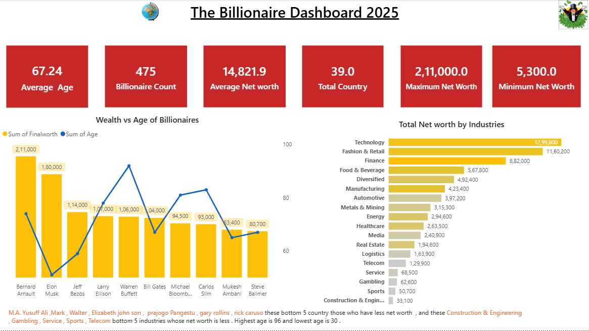
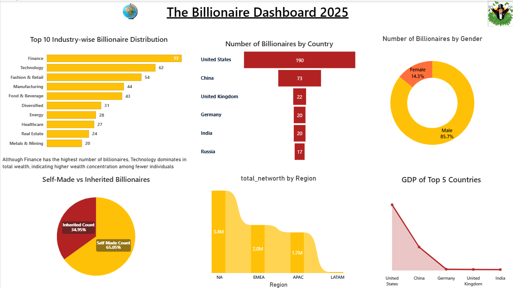

# 💰 The Billionaire Data Dashboard 2025
### An Interactive Power BI Report Analyzing the World's Wealthiest Individuals


---

## 📌 Project Overview

This Power BI dashboard delivers a **multi-page visual analysis** of the world's billionaires in 2025 — covering net worth, industries, countries, gender distribution, wealth origins, and macroeconomic factors like inflation and GDP. Designed to turn complex data into clear, compelling narratives.

> *Who are the richest people on Earth? What industries created them? Are they self-made or inherited? This dashboard answers it all.*

---

## 🖼️ Dashboard Screenshots

### 📄 Page 1 — Overview


### 📄 Page 2 — Wealth Insights


### 📄 Page 3 — Deep Insights


---

## 📊 Key Metrics (From the Dashboard)

| Metric | Value |
|---|---|
| 👥 Total Billionaires | **475** |
| 💵 Average Net Worth | **$14,821.9M** |
| 🏆 Maximum Net Worth | **$2,11,000M** (Bernard Arnault) |
| 📉 Minimum Net Worth | **$5,300M** |
| 🎂 Average Age | **67.24 years** |
| 🌍 Countries Represented | **39** |

---

## 🔍 Key Insights

### 🏭 Industry
- **Technology** leads in *total* wealth at $12,99,800M — despite Finance having the most billionaires (77)
- **Fashion & Retail** ranks 2nd in total net worth at $11,60,200M
- Finance has the highest *count* (77) but lower wealth concentration per person

### 🌍 Geography
- 🇺🇸 **United States** dominates with **190 billionaires** — nearly 3× more than China (73)
- **EMEA region** leads in total net worth ($3.4M), followed by NA ($2.0M) and APAC ($1.7M)
- **EMEA** also generates the highest tax revenue at $2,589.1B

### 👤 Gender
- Only **14.3% of billionaires are female** — yet their average net worth is **46.55%** of the total average, showing strong wealth concentration among fewer women

### 💼 Self-Made vs Inherited
- **65.05%** of billionaires are **self-made** — proving wealth creation is more common than wealth inheritance

### 📈 Inflation & Wealth
- **Low inflation countries** host **342 billionaires** — stable economies foster business growth
- **Very high inflation countries** have only **6 billionaires** — economic instability limits wealth building

### 🏆 Top Billionaires by Net Worth
| Rank | Name | Net Worth |
|---|---|---|
| 1 | Bernard Arnault | $2,11,000M |
| 2 | Elon Musk | $1,80,000M |
| 3 | Jeff Bezos | $1,14,000M |
| 4 | Larry Ellison | $1,07,000M |
| 5 | Warren Buffett | $1,06,000M |

---

## ✨ Dashboard Features

| Feature | Description |
|---|---|
| 📊 **KPI Cards** | Average age, billionaire count, net worth range, total countries |
| 🏭 **Industry Analysis** | Top 10 industries by count & total net worth |
| 🗺️ **Country Comparison** | Billionaire count by country (bar chart) |
| 🥧 **Gender Breakdown** | Count and average net worth split by gender |
| 📉 **Wealth vs Age** | Combo chart correlating net worth and age per billionaire |
| 🌍 **Regional Net Worth** | EMEA, NA, APAC, LATAM comparison |
| 💹 **Inflation Analysis** | Billionaire presence across inflation categories |
| 🏥 **Life Expectancy** | Top 6 countries — Japan leads at 84.20 years |
| 💰 **Wealth Origin** | Net worth by company/source (Walmart, LVMH, Tesla...) |
| 🧬 **Self-Made vs Inherited** | 65% self-made vs 35% inherited breakdown |
| 📊 **GDP Comparison** | GDP of top 5 billionaire-producing countries |
| 💸 **Tax Revenue by Region** | Regional government tax revenue distribution |

---

## 🛠️ Tools & Technologies

- **Power BI Desktop** — Dashboard creation, data modeling & visualization
- **Power Query (M Language)** — Data cleaning & transformation
- **DAX (Data Analysis Expressions)** — Custom KPIs and calculated measures
- **Data Source** — Forbes Billionaires 2025 Dataset

---

## 🚀 How to Open & Explore

1. **Clone this repository**
   ```bash
   git clone https://github.com/your-username/billionaire-dashboard.git
   ```

2. **Install Power BI Desktop** (free)
   👉 [Download here](https://powerbi.microsoft.com/desktop/)

3. **Open the file**
   - Launch Power BI Desktop
   - Open `the_billionaire_data_dashboard.pbix`

4. **Explore all 3 pages**
   - Use **slicers** to filter by country, industry, or gender
   - Click any chart to **cross-filter** other visuals
   - Hover over data points for **detailed tooltips**

---

## 📁 Repository Structure

```
billionaire-dashboard/
│
├── 📊 the_billionaire_data_dashboard.pbix   # Main Power BI file
├── 🖼️  Overview.png                         # Page 1 screenshot
├── 🖼️  Wealth_Insights.png                  # Page 2 screenshot
├── 🖼️  Deep_Insights.png                    # Page 3 screenshot
└── 📄 README.md                             # You are here
```

---

## 🙋‍♂️ Author

**Your Name**
📧 your.email@example.com
🔗 [LinkedIn](https://linkedin.com/in/your-profile) | [Portfolio](https://yourportfolio.com)

---

⭐ *If you found this project insightful, please give it a star — it helps others discover it!*

---
*Built with ❤️ using Power BI*
